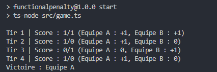
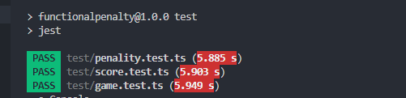

# FunctionalPenalty

**Description**

Ce projet simule une séance de tirs au but dans un match de football, développé en TypeScript avec une approche fonctionnelle. Il met en pratique des concepts tels que l'immutabilité, les fonctions pures, et l'absence d'effets de bord. Le programme gère les tirs au but de deux équipes, met à jour le score après chaque tir et affiche l'historique complet de la séance ainsi que le résultat final.

L'objectif du projet est de respecter les principes de la programmation fonctionnelle tout en proposant une simulation fidèle des scénarios de tirs au but, avec des règles avancées comme l'arrêt anticipé en cas d'avantage décisif.

**Contenu du projet**

- `src/game.ts` : Code principal qui simule le jeu en appelant les fonctions de pénalty, de mise à jour des scores et d'historique.
- `src/penalty.ts` : Simule les tirs de pénalty avec des résultats aléatoires.
- `src/score.ts` : Gère la mise à jour des scores après chaque tir.
- `src/history.ts` : Met à jour et affiche l'historique complet des tirs.
- `test/` : Contient les tests unitaires pour vérifier le bon fonctionnement des différentes fonctions.

**Fonctionnalités principales**

- **Simulation de tirs au but** : Chaque équipe tire à tour de rôle avec un résultat aléatoire (marqué ou manqué).
- **Mise à jour des scores** : Le score des deux équipes est mis à jour après chaque tir.
- **Arrêt anticipé** : La séance se termine dès qu'une équipe prend un avantage décisif.
- **Historique de la séance** : Un historique détaillé des tirs et des scores est affiché dans la console.
- **Affichage du gagnant** : Le programme affiche l'équipe gagnante à la fin de la séance.

**Prérequis**

- **Node.js** : Version 18 ou supérieure
- **npm** : Installé avec Node.js
- **TypeScript** : Inclus dans le projet via `ts-node`

**Installation**

Clone le dépôt sur votre machine locale :

'git clone https://github.com/DH-HUB/FunctionalPenalty.git'

 **Accédez au dossier du projet :**
'cd FunctionalPenalty'

**Installez les dépendances nécessaires :**
'npm install'

**Pour exécuter le programme, utilisez la commande suivante :**
'Pour exécuter le programme, utilisez la commande suivante :'
**Exemple de sortie :**

**our exécuter les tests, lancez la commande suivante :**

'npm test'

**Exemple de sortie des tests :**

**Auteur : Hakima Djermouni **

>Contributions bienvenues ! Ouvrez une issue ou soumettez une pull request.

>Licence Ce projet est sous licence MIT - voir le fichier LICENSE pour plus de détails.
